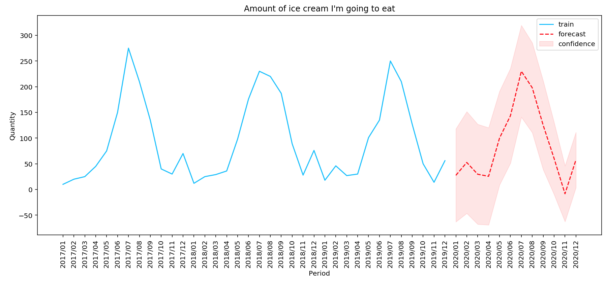

<div align="center">
    <h1>Online autoregressive bayesian linear regression</h1>
</div>
</br>

This minimalist tool is dedicated to the bayesian linear regression implemented by **[Max Halford](https://github.com/MaxHalford)** in his blog post **[Bayesian linear regression for practitioners](https://maxhalford.github.io/blog/bayesian-linear-regression/)**. I slightly modified the code to obtain an autoregressive version of the original model.

**For the time being, the model will systematically assume that the residues follow a normal distribution. It will be necessary to wait for the next updates of the library to include new distributions.**

Bayesian linear regression has many advantages. It allows to measure the **uncertainty** of the model and to build **confidence intervals**. The simplicity of this model and its ability to answer "I don't know" makes it practical and adapted to many **concrete problems**.

Its online autoregressive counterpart is a nice tool for the toolbox of programmers, hackers and practitioners.

#### Installation:

```
pip install git+https://github.com/raphaelsty/abayes
```

#### Example:

Let's try to predict my ice cream consumption. I have created a dummy dataset where I record my ice cream consumption for each month of the year and for 3 years.

```python3
from abayes import dataset
df = dataset.LoadIceCream()
df.head()
```

<div align="center">


</div>
<br>

We initialise the auto-regressive model with a periodicity of 24. We will use the years n-1 and n-2 to predict my ice consumption in year n.

```python3
from abayes import linear

model = linear.AbayesLr(
    p     = 24,
    alpha = 0.3,
    beta  = 1.,
)

model.learn(df['y'].values)

forecast = model.forecast(12)

lower_bound, upper_bound = model.forecast_interval(12, alpha = 0.90)
```

<details><summary>plot</summary>

```python3
import matplotlib.pyplot as plt

%config InlineBackend.figure_format = 'retina'

range_train    = range(len(df['y']))
range_forecast = range(len(df['y']), len(df['y']) + len(forecast))

fig, ax = plt.subplots(figsize=(15, 6))

ax.plot(range_train, df['y'], color='deepskyblue', label ='train')

ax.plot(range_forecast, forecast, color='red', linestyle='--', label ='forecast')

ax.fill_between(
    x     = range_forecast,
    y1    = lower_bound,
    y2    = upper_bound,
    alpha = 0.1,
    color = 'red',
    label = 'confidence'
)

plt.xticks(
    range(len(df['y']) + len(forecast)), 
    df['time'].tolist() + [f"2020/{'%02d' % i}" for i in range(1, 13)], 
    rotation='vertical'
)

ax.set_title('Quantity of ice cream')

ax.set_xlabel('Period')

ax.set_ylabel('Quantity')

ax.legend()

plt.show()
```

</details>



**The model can also learn by mini-batch.**

```python3
import numpy as np

from abayes import linear

model = linear.AbayesLr(
    p     = 24,
    alpha = 0.3,
    beta  = 1,
)

for time, y in enumerate(df['y'].values):
    
    # Online autoregressive model needs to store enough data to make a prediction (> period).
    if time > 24:
        
        lower_bound, upper_bound = model.forecast_interval(1, alpha = 0.9)
        y_pred = model.forecast(1)
        
        print('\n')
        print(f'time: {time}')
        print(f'\t y: {y}')
        print(f'\t Most likely value: {y_pred[0]:6f}')
        print(f'\t Confidence interval: [{lower_bound[0]:6f} ; {upper_bound[0]:6f}]')
    
    model.learn(np.array([y]))
```

```
time: 25
	 y: 46
	 Most likely value: 16.066921
	 Confidence interval: [-231.651593 ; 263.785435]


time: 26
	 y: 27
	 Most likely value: 50.016886
	 Confidence interval: [-179.828306 ; 279.862078]


time: 27
	 y: 30
	 Most likely value: 16.442225
	 Confidence interval: [-214.224545 ; 247.108994]


time: 28
	 y: 101
	 Most likely value: 21.766659
	 Confidence interval: [-205.891318 ; 249.424635]


time: 29
	 y: 135
	 Most likely value: 106.731389
	 Confidence interval: [-124.906692 ; 338.369470]


time: 30
	 y: 250
	 Most likely value: 143.074596
	 Confidence interval: [-75.066693 ; 361.215885]


time: 31
	 y: 210
	 Most likely value: 231.908803
	 Confidence interval: [38.905614 ; 424.911993]


time: 32
	 y: 127
	 Most likely value: 165.226916
	 Confidence interval: [-17.324602 ; 347.778435]


time: 33
	 y: 50
	 Most likely value: 78.684325
	 Confidence interval: [-75.679416 ; 233.048066]


time: 34
	 y: 14
	 Most likely value: -14.522046
	 Confidence interval: [-157.498855 ; 128.454763]


time: 35
	 y: 56
	 Most likely value: 52.063575
	 Confidence interval: [-50.776582 ; 154.903732]
```

#### License

This project is free and open-source software licensed under the MIT license.
